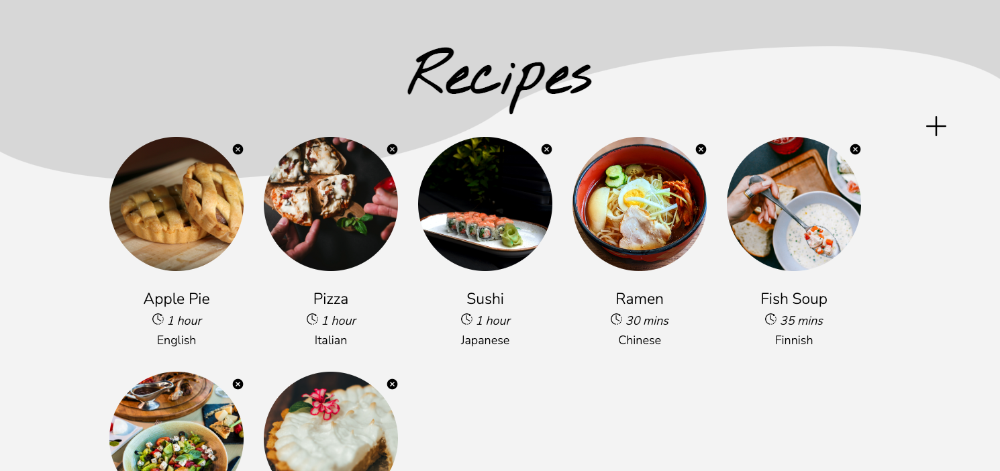
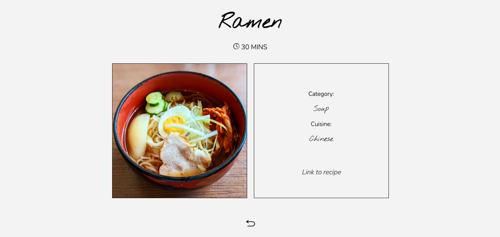
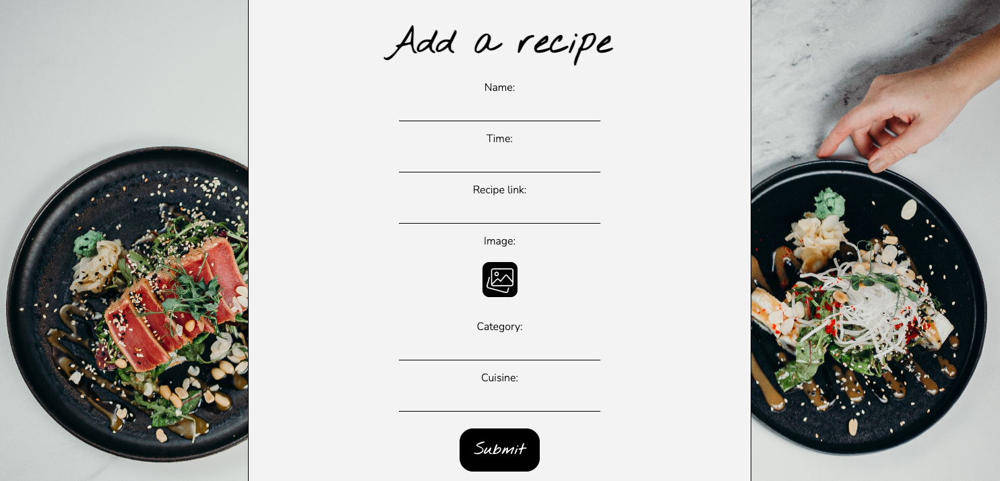
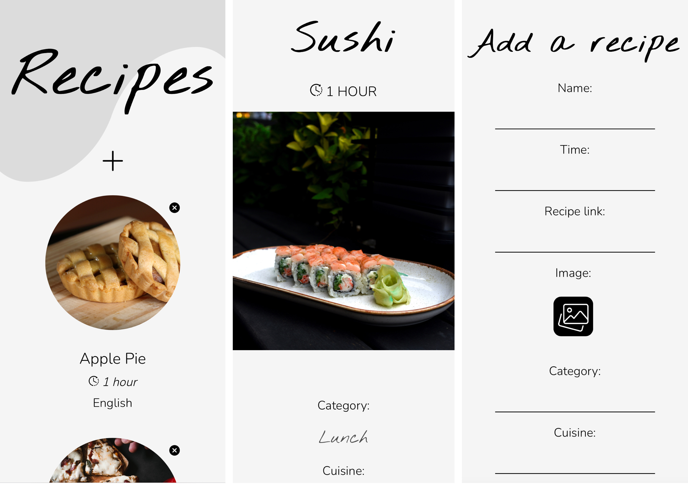

# Foodie

Foodie App stores different foods with a few properties, like name, link to recipe, and image and so on.

### Technologies

- Java Spring Boot
- HTML
- CSS
- MySQL

## Front page:

 

## Details page:

## Add page:

 

##Mobile view:

 
